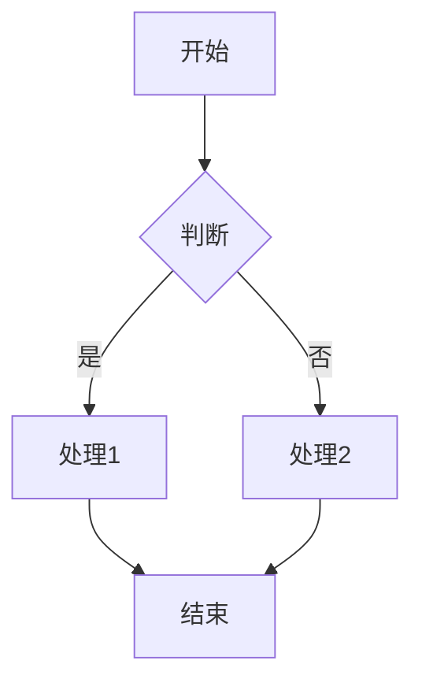
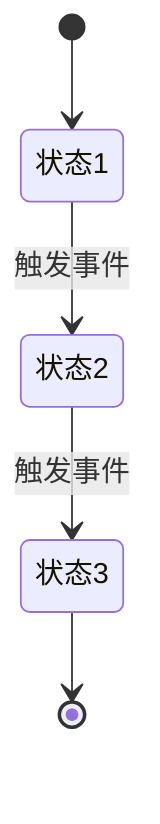
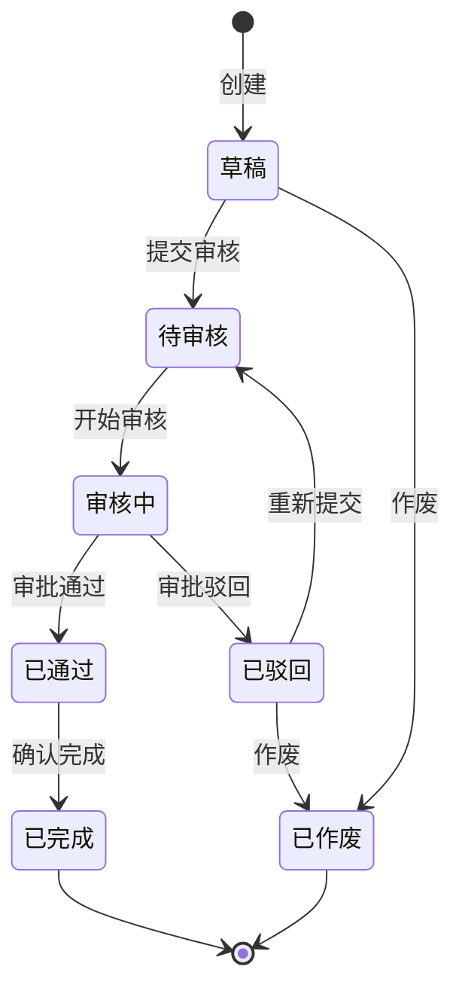
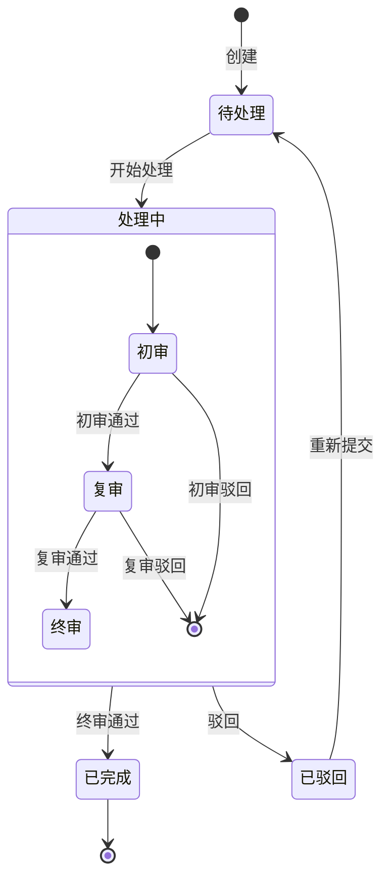
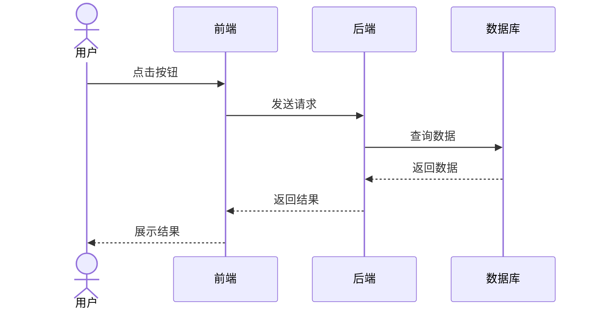
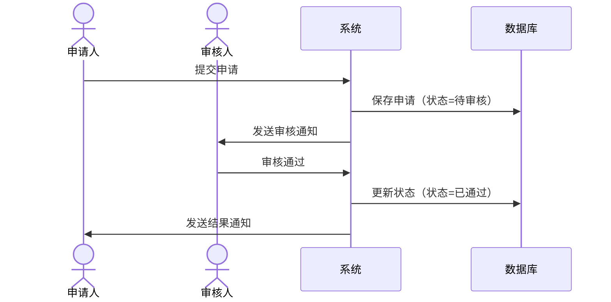
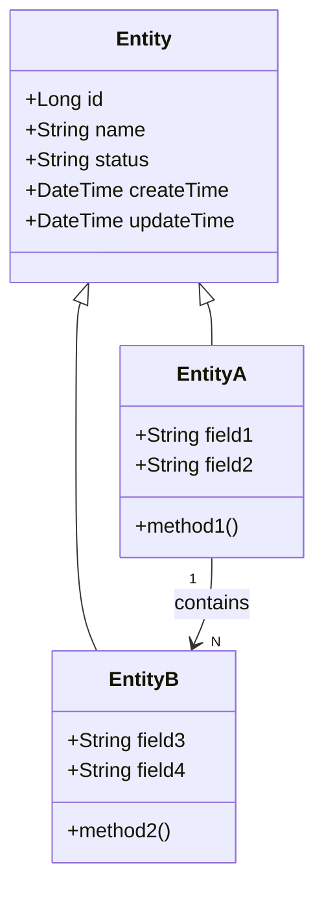
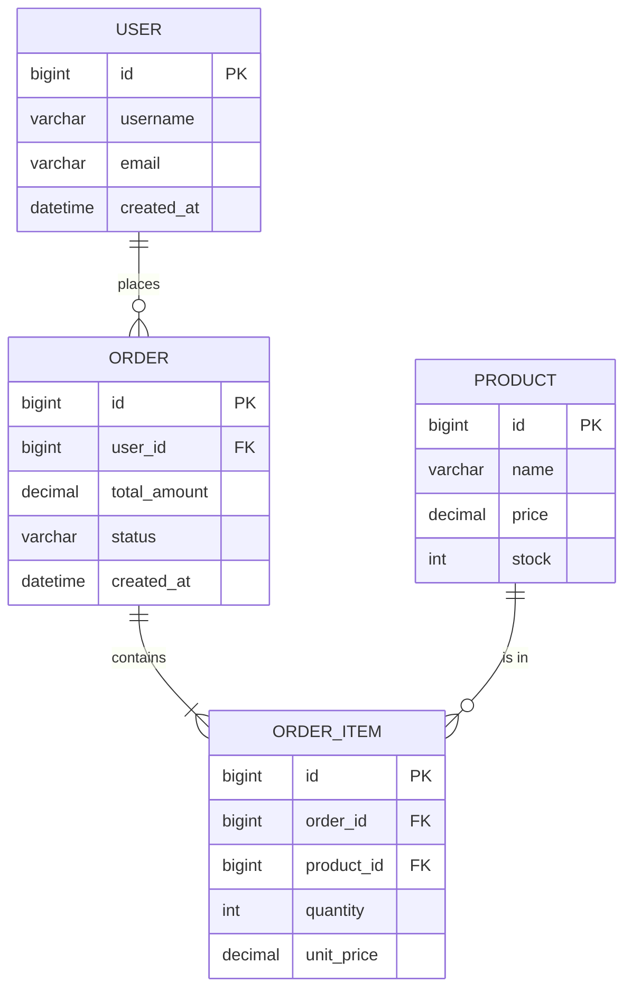

# 架构设计模块

> 产品经理核心能力之二：系统架构设计

---

## 适用场景

- 系统整体架构规划
- 功能模块划分与关系梳理
- 技术选型建议

---

## 设计框架

### 1. 功能结构图

```
系统
├── 模块A
│   ├── 功能A1
│   └── 功能A2
├── 模块B
│   ├── 功能B1
│   └── 功能B2
└── 模块C
```

### 2. 业务流程图



### 3. 状态流转图



### 4. ER图设计

```mermaid
erDiagram
    实体A ||--o{ 实体B : 1:N
    实体B }o--|| 实体C : N:1
```

### 5. 架构分层

```
表现层（前端/移动端）
    ↓
接入层（网关/负载均衡）
    ↓
接口层（Controller/API）
    ↓
业务层（Service/Domain）
    ↓
持久层（Repository/Mapper）
    ↓
数据层（MySQL/Redis/ES）
```

---

## 状态流转图模板

### 简单状态流转



### 复杂状态流转（含子状态）



---

## 时序图模板

### 用户操作时序图



### 审批流程时序图



---

## 类图模板



---

## ER图模板



---

## 输出物

- 功能结构说明书
- 业务流程图
- 状态流转图
- 时序图
- 类图
- ER图
- 技术架构图
