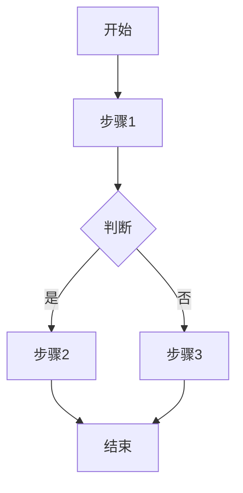
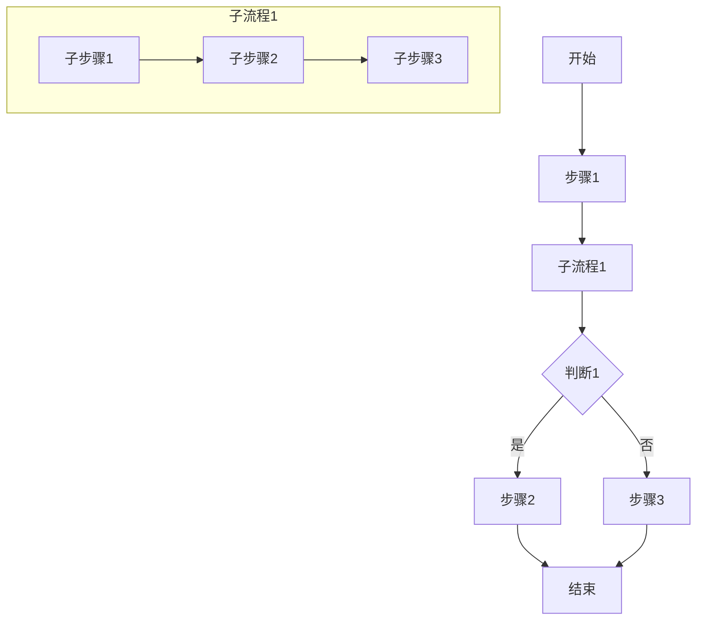
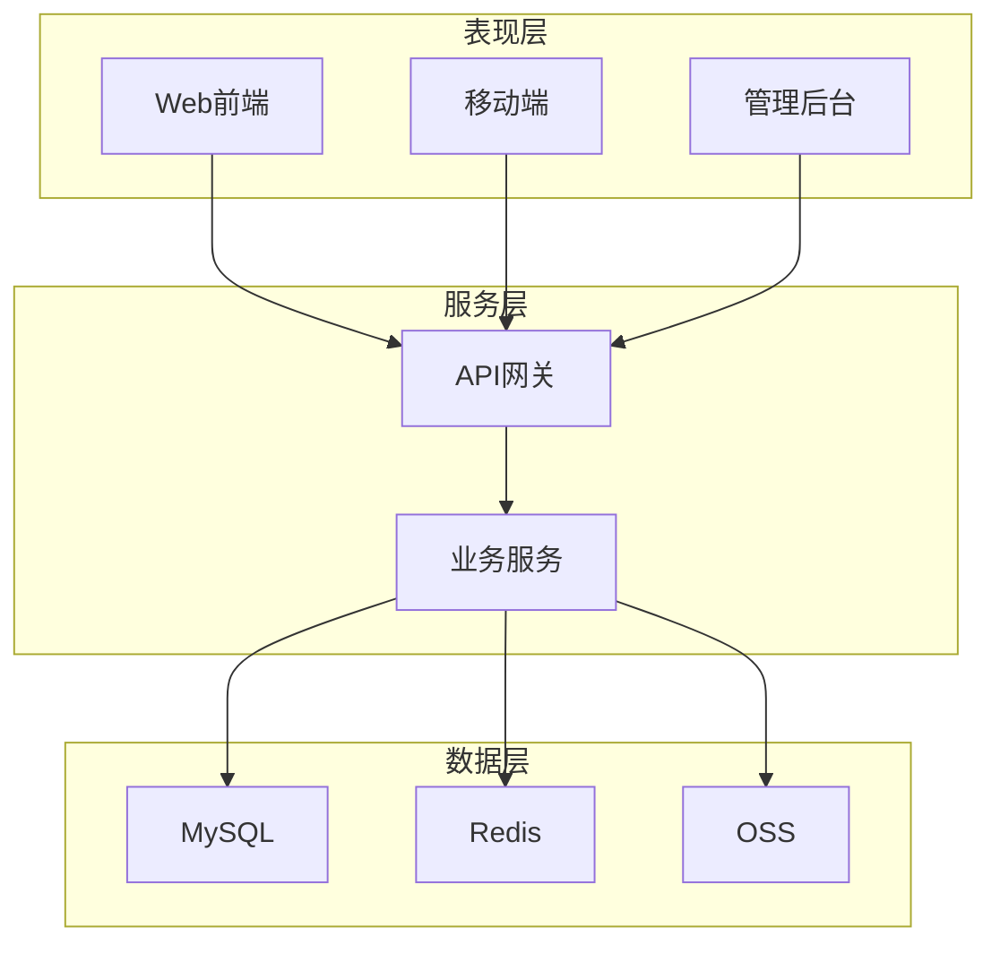
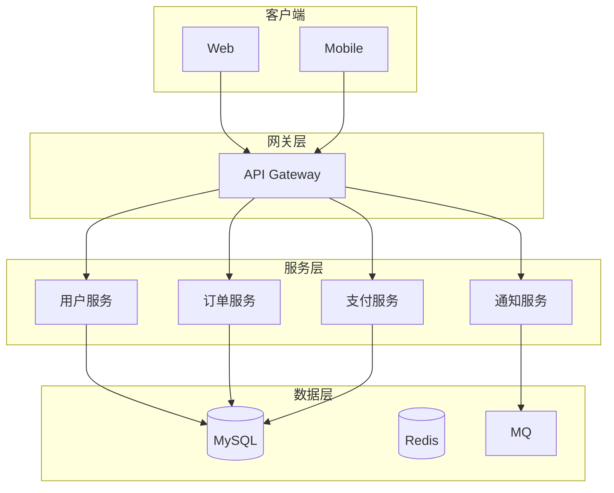
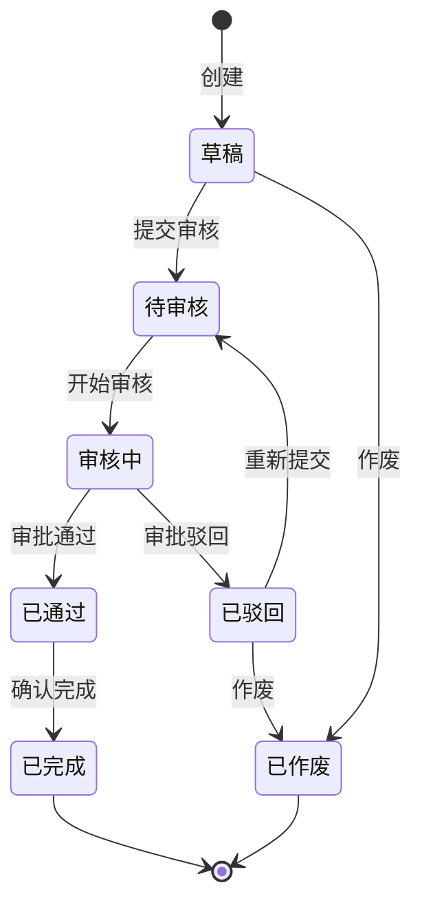
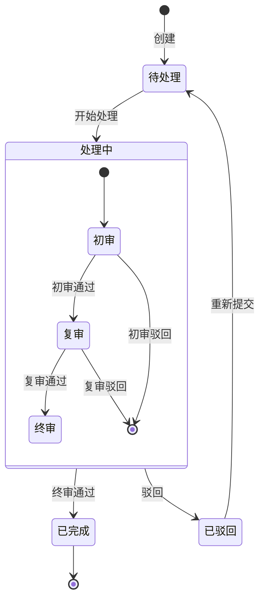
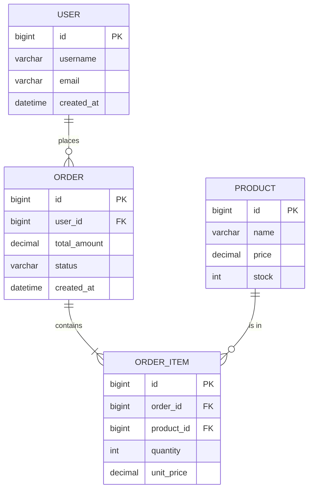
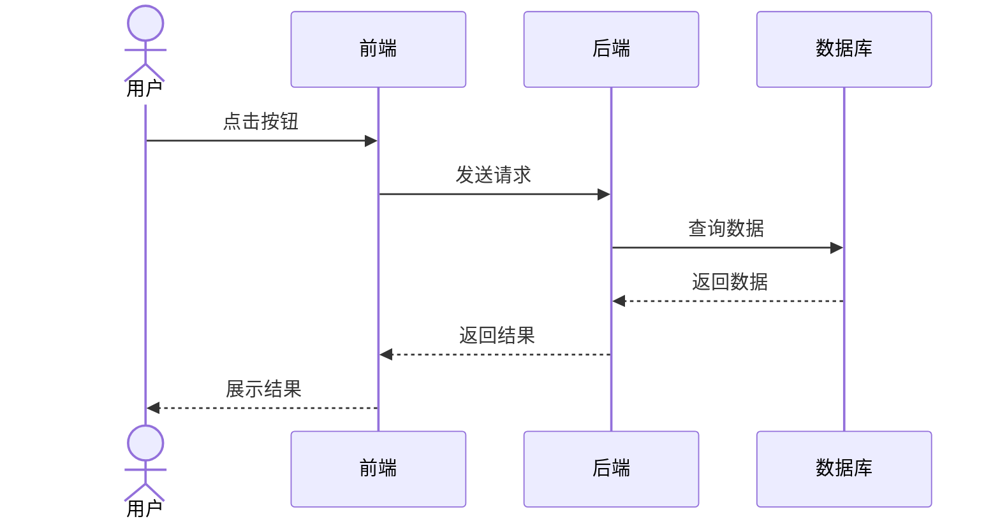
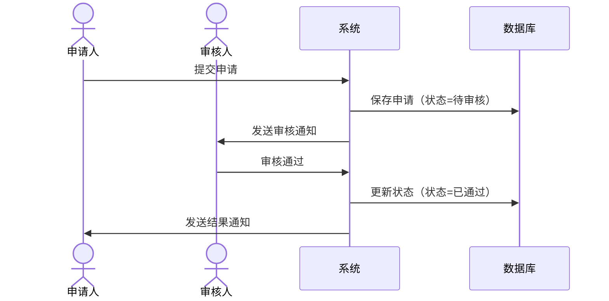
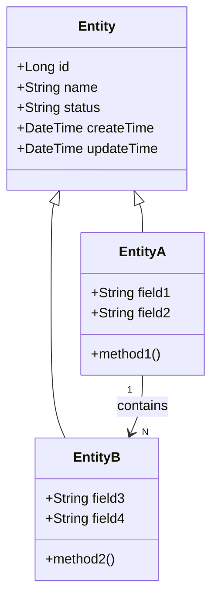

# 架构设计模块

> 产品经理核心能力之二：系统架构设计
> 参考标准：CMMI 3.0 TS（技术解决方案）

---

## 适用场景

- 系统整体架构规划
- 功能模块划分与关系梳理
- 业务流程设计
- 数据模型设计
- 接口设计

---

## 设计全流程

```
业务分析 → 架构设计 → 详细设计 → 设计评审 → 设计定稿
   ↓           ↓           ↓           ↓           ↓
业务流程     系统架构     数据模型     设计走查     基线建立
功能拆解     模块划分     接口设计     问题修复     文档归档
```

---

## 一、业务流程设计

### 1.1 业务流程图绘制规范

**基本符号**
```
开始/结束：圆角矩形 ○
处理步骤：矩形 □
判断条件：菱形 ◇
数据：平行四边形 ▱
流程方向：箭头 →
```

**绘制原则**
- 从左到右、从上到下
- 每个步骤有明确的输入和输出
- 判断条件有明确的"是/否"分支
- 避免交叉线

### 1.2 业务流程图模板

**简单流程**


**复杂流程（含子流程）**


### 1.3 业务流程说明模板

```markdown
## 业务流程：[流程名称]

### 流程概述
- **流程目的**：[描述流程的目的]
- **触发条件**：[什么情况下触发流程]
- **参与角色**：[哪些角色参与流程]
- **流程周期**：[流程预计耗时]

### 流程步骤

| 步骤 | 操作 | 操作人 | 输入 | 输出 | 说明 |
|------|------|--------|------|------|------|
| 1 | 提交申请 | 申请人 | 申请表 | 申请记录 | |
| 2 | 审核申请 | 审核人 | 申请记录 | 审核结果 | |
| 3 | 执行操作 | 执行人 | 审核结果 | 执行结果 | |

### 异常流程

| 异常场景 | 处理方式 |
|----------|----------|
| 申请被驳回 | 申请人修改后重新提交 |
| 超时未处理 | 系统自动提醒/升级 |

### 流程规则
1. 规则1：[描述]
2. 规则2：[描述]
```

---

## 二、系统架构设计

### 2.1 架构分层

```
表现层（Presentation Layer）
├── Web前端（Vue/React）
├── 移动端（iOS/Android）
└── 管理后台（Admin UI）

接入层（Access Layer）
├── 网关（Nginx/Kong）
├── 负载均衡（LB）
└── CDN

接口层（API Layer）
├── REST API
├── GraphQL
└── WebSocket

业务层（Business Layer）
├── 业务服务（Service）
├── 领域模型（Domain）
└── 业务规则（Rule）

数据层（Data Layer）
├── 关系数据库（MySQL/PostgreSQL）
├── 缓存（Redis）
├── 搜索引擎（ES）
└── 文件存储（OSS）

基础设施层（Infrastructure Layer）
├── 消息队列（RabbitMQ/Kafka）
├── 任务调度（XXL-JOB）
├── 日志系统（ELK）
└── 监控系统（Prometheus）
```

### 2.2 系统架构图模板

**单体架构**


**微服务架构**


### 2.3 模块划分

**模块划分原则**
- 高内聚、低耦合
- 单一职责
- 按业务领域划分

**模块说明模板**
```markdown
## 模块：[模块名称]

### 模块职责
- 负责XX业务的处理
- 提供XX功能

### 模块边界
- **输入**：接收XX数据
- **输出**：提供XX数据
- **依赖**：依赖XX模块
- **被依赖**：被XX模块依赖

### 核心功能
| 功能 | 说明 | 接口 |
|------|------|------|
| 功能1 | | API-001 |
| 功能2 | | API-002 |

### 数据模型
- 实体1：[说明]
- 实体2：[说明]
```

---

## 三、功能结构设计

### 3.1 功能结构图

```
系统
├── 模块A
│   ├── 功能A1
│   │   ├── 子功能A1.1
│   │   └── 子功能A1.2
│   └── 功能A2
├── 模块B
│   ├── 功能B1
│   └── 功能B2
└── 模块C
```

### 3.2 功能清单模板

```markdown
## 功能清单

### 模块A：[模块名称]

| 功能ID | 功能名称 | 功能说明 | 优先级 | 状态 |
|--------|----------|----------|--------|------|
| F-A-001 | 功能A1 | | P0 | 待开发 |
| F-A-002 | 功能A2 | | P1 | 待开发 |

### 模块B：[模块名称]

| 功能ID | 功能名称 | 功能说明 | 优先级 | 状态 |
|--------|----------|----------|--------|------|
| F-B-001 | 功能B1 | | P0 | 待开发 |
| F-B-002 | 功能B2 | | P1 | 待开发 |
```

---

## 四、状态流转设计

### 4.1 状态流转图

**简单状态流转**


**复杂状态流转（含子状态）**


### 4.2 状态流转说明模板

```markdown
## 状态流转：[业务对象]

### 状态定义

| 状态 | 编码 | 说明 | 标签颜色 |
|------|------|------|----------|
| 草稿 | DRAFT | 初始状态 | 灰色 |
| 待审核 | PENDING | 等待审核 | 橙色 |
| 审核中 | REVIEWING | 正在审核 | 蓝色 |
| 已通过 | APPROVED | 审核通过 | 绿色 |
| 已驳回 | REJECTED | 审核驳回 | 红色 |
| 已完成 | COMPLETED | 流程结束 | 绿色 |
| 已作废 | VOID | 作废状态 | 灰色 |

### 操作×状态矩阵

| 操作 \ 状态 | 草稿 | 待审核 | 审核中 | 已通过 | 已驳回 | 已完成 | 已作废 |
|------------|:----:|:------:|:------:|:------:|:------:|:------:|:------:|
| 编辑 | ✅ | ❌ | ❌ | ❌ | ❌ | ❌ | ❌ |
| 提交审核 | ✅ | ❌ | ❌ | ❌ | ❌ | ❌ | ❌ |
| 审核通过 | ❌ | ❌ | ✅ | ❌ | ❌ | ❌ | ❌ |
| 审核驳回 | ❌ | ❌ | ✅ | ❌ | ❌ | ❌ | ❌ |
| 确认完成 | ❌ | ❌ | ❌ | ✅ | ❌ | ❌ | ❌ |
| 重新提交 | ❌ | ❌ | ❌ | ❌ | ✅ | ❌ | ❌ |
| 作废 | ✅ | ✅ | ❌ | ❌ | ✅ | ❌ | ❌ |
| 删除 | ✅ | ❌ | ❌ | ❌ | ❌ | ❌ | ❌ |

### 各角色处理逻辑

#### 角色1：申请人

| 状态 | 可执行操作 | 操作说明 | 前置条件 | 后置结果 |
|------|-----------|----------|----------|----------|
| 草稿 | 编辑 | 修改申请内容 | 无 | 状态不变 |
| 草稿 | 提交审核 | 提交至审核人 | 必填项完整 | 状态→待审核 |
| 草稿 | 作废 | 作废申请 | 无 | 状态→已作废 |
| 已驳回 | 重新提交 | 修改后重新提交 | 无 | 状态→待审核 |
| 已驳回 | 作废 | 作废申请 | 无 | 状态→已作废 |

#### 角色2：审核人

| 状态 | 可执行操作 | 操作说明 | 前置条件 | 后置结果 |
|------|-----------|----------|----------|----------|
| 待审核 | 开始审核 | 开始审核流程 | 无 | 状态→审核中 |
| 审核中 | 审核通过 | 审批通过 | 填写审核意见 | 状态→已通过 |
| 审核中 | 审核驳回 | 审批驳回 | 必填驳回原因 | 状态→已驳回 |

#### 角色3：确认人

| 状态 | 可执行操作 | 操作说明 | 前置条件 | 后置结果 |
|------|-----------|----------|----------|----------|
| 已通过 | 确认完成 | 确认流程完成 | 无 | 状态→已完成 |
```

---

## 五、数据模型设计

### 5.1 ER图设计

**ER图符号**
```
实体：矩形框
属性：椭圆
关系：菱形
连接线：直线
基数：1:1, 1:N, M:N
```

**ER图模板**


### 5.2 数据字典模板

```markdown
## 数据字典

### 表名：[table_name]

| 字段名 | 类型 | 长度 | 必填 | 默认值 | 说明 |
|--------|------|------|------|--------|------|
| id | bigint | 20 | 是 | 自增 | 主键 |
| name | varchar | 100 | 是 | | 名称 |
| status | tinyint | 1 | 是 | 0 | 状态 |
| created_at | datetime | | 是 | CURRENT_TIMESTAMP | 创建时间 |
| updated_at | datetime | | 是 | CURRENT_TIMESTAMP | 更新时间 |

### 索引

| 索引名 | 字段 | 类型 | 说明 |
|--------|------|------|------|
| PRIMARY | id | 主键 | 主键索引 |
| idx_name | name | 普通 | 名称索引 |
| uk_code | code | 唯一 | 编码唯一索引 |
```

---

## 六、接口设计

### 6.1 RESTful API设计规范

**URL命名规范**
```
资源集合：/api/v1/resources
单个资源：/api/v1/resources/{id}
子资源：/api/v1/resources/{id}/sub-resources

示例：
GET    /api/v1/users          # 获取用户列表
GET    /api/v1/users/{id}     # 获取单个用户
POST   /api/v1/users          # 创建用户
PUT    /api/v1/users/{id}     # 更新用户
DELETE /api/v1/users/{id}     # 删除用户
```

**HTTP方法**
```
GET     # 查询
POST    # 创建
PUT     # 更新（全量）
PATCH   # 更新（部分）
DELETE  # 删除
```

**状态码**
```
200 OK                  # 成功
201 Created             # 创建成功
400 Bad Request         # 请求参数错误
401 Unauthorized        # 未认证
403 Forbidden           # 无权限
404 Not Found           # 资源不存在
500 Internal Error      # 服务器错误
```

### 6.2 接口文档模板

```markdown
## 接口：[接口名称]

### 基本信息
- **接口地址**：`GET /api/v1/users`
- **接口说明**：获取用户列表
- **认证方式**：Bearer Token
- **权限要求**：user:list

### 请求参数

#### Query参数

| 参数名 | 类型 | 必填 | 默认值 | 说明 |
|--------|------|------|--------|------|
| page | int | 否 | 1 | 页码 |
| size | int | 否 | 20 | 每页条数 |
| keyword | string | 否 | | 搜索关键词 |

#### Body参数（POST/PUT）

```json
{
  "name": "张三",
  "email": "zhangsan@example.com",
  "phone": "13800138000"
}
```

### 响应格式

#### 成功响应

```json
{
  "code": 200,
  "message": "success",
  "data": {
    "list": [...],
    "total": 100,
    "page": 1,
    "size": 20
  }
}
```

#### 错误响应

```json
{
  "code": 400,
  "message": "参数错误",
  "errors": [
    {
      "field": "name",
      "message": "名称不能为空"
    }
  ]
}
```

### 错误码

| 错误码 | 说明 |
|--------|------|
| 40001 | 参数错误 |
| 40002 | 数据不存在 |
| 40003 | 无权限 |
```

### 6.3 接口清单模板

```markdown
## 接口清单

### 用户模块

| 接口 | 方法 | 地址 | 说明 | 权限 |
|------|------|------|------|------|
| 用户列表 | GET | /api/v1/users | 获取用户列表 | user:list |
| 用户详情 | GET | /api/v1/users/{id} | 获取用户详情 | user:detail |
| 创建用户 | POST | /api/v1/users | 创建用户 | user:create |
| 更新用户 | PUT | /api/v1/users/{id} | 更新用户 | user:update |
| 删除用户 | DELETE | /api/v1/users/{id} | 删除用户 | user:delete |
```

---

## 七、时序图设计

### 7.1 用户操作时序图



### 7.2 审批流程时序图



### 7.3 时序图模板

```markdown
## 时序图：[场景名称]

### 场景描述
- **触发条件**：[什么情况下触发]
- **参与角色**：[哪些角色参与]
- **预期结果**：[期望达到什么效果]

### 时序图

[Mermaid代码]

### 说明
1. 步骤1：[说明]
2. 步骤2：[说明]
```

---

## 八、类图设计

### 8.1 类图模板



### 8.2 类图说明模板

```markdown
## 类图：[模块名称]

### 实体说明

#### Entity
- **说明**：基础实体
- **属性**：
  - id：主键
  - name：名称
  - status：状态
  - createTime：创建时间
  - updateTime：更新时间

#### EntityA
- **说明**：实体A
- **属性**：
  - field1：字段1
  - field2：字段2
- **方法**：
  - method1()：方法1

### 关系说明
- EntityA 继承 Entity
- EntityA 1:N EntityB
```

---

## 九、输出物清单

| 输出物 | 说明 | 模板文件 |
|--------|------|----------|
| 业务流程图 | 核心业务流程 | - |
| 系统架构图 | 系统整体架构 | - |
| 功能结构图 | 功能模块划分 | - |
| 状态流转图 | 业务状态流转 | - |
| ER图 | 数据模型设计 | - |
| 时序图 | 交互流程设计 | - |
| 类图 | 实体关系设计 | - |
| 接口文档 | API设计文档 | - |
| 数据字典 | 数据库字段说明 | - |
| 技术决策记录 | ADR（Architecture Decision Record） | - |
