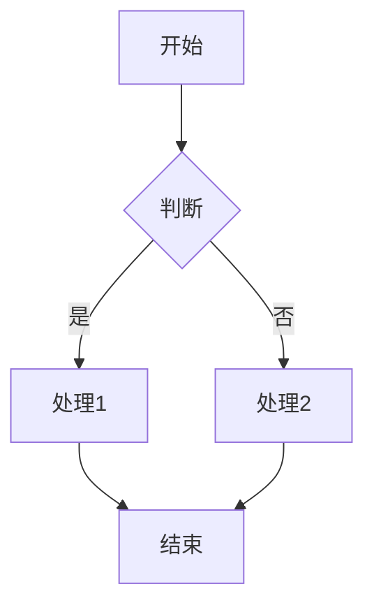
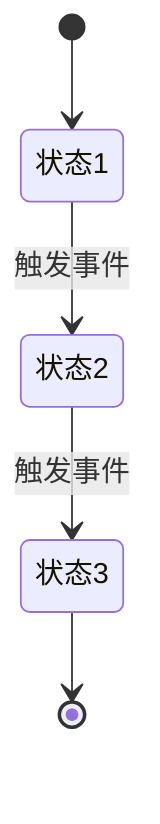
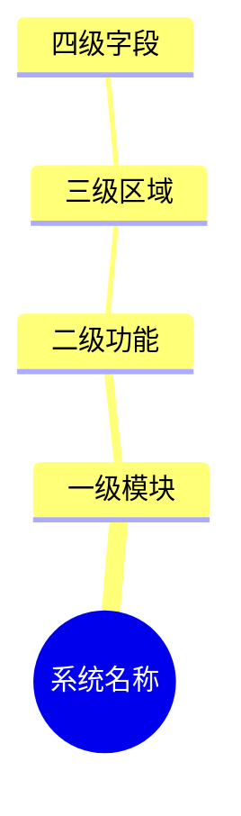

# Product Manager Skill

> 专业产品经理核心能力：需求分析、架构设计、需求文档编写、原型设计、信息架构梳理

---

## 能力模块

### 模块一：需求分析

#### 适用场景
- 新项目/新功能的需求调研
- 用户访谈、竞品分析
- 需求评估与优先级排序

#### 分析框架

**1. 用户分析**
```
目标用户 → 用户角色 → 用户场景 → 用户痛点 → 用户目标
```

**2. 需求拆解**
```
业务需求 → 功能需求 → 非功能需求 → 约束条件
```

**3. 优先级评估**

| 维度 | 权重 | 评估项 |
|------|------|--------|
| 业务价值 | 40% | 收入影响、效率提升、用户满意度 |
| 实现成本 | 30% | 开发工时、技术难度、依赖项 |
| 风险程度 | 20% | 技术风险、业务风险、合规风险 |
| 紧急程度 | 10% | 截止日期、依赖关系 |

**4. 需求规格模板**

```markdown
| 项目 | 内容 |
|------|------|
| 需求ID | FR-XXX |
| 需求名称 | |
| 优先级 | P0/P1/P2/P3 |
| 需求描述 | 作为[角色]，我希望[功能]，以便[价值] |
| 目标用户 | |
| 触发条件 | |
| 输入/前置条件 | |
| 执行步骤 | 1. 2. 3. |
| 输出/后置动作 | |
| 异常处理 | |
| 验收标准 | AC1: AC2: |
```

#### 输出物
- 需求池管理文档
- 需求规格说明书（SRS）
- 需求评审检查清单

---

### 模块二：架构设计

#### 适用场景
- 系统整体架构规划
- 功能模块划分与关系梳理
- 技术选型建议

#### 设计框架

**1. 功能结构图**
```
系统
├── 模块A
│   ├── 功能A1
│   └── 功能A2
├── 模块B
│   ├── 功能B1
│   └── 功能B2
└── 模块C
```

**2. 业务流程图**


**3. 状态流转图**


**4. ER图设计**
```mermaid
erDiagram
    实体A ||--o{ 实体B : 1:N
    实体B }o--|| 实体C : N:1
```

**5. 架构分层**
```
表现层（前端/移动端）
    ↓
接入层（网关/负载均衡）
    ↓
接口层（Controller/API）
    ↓
业务层（Service/Domain）
    ↓
持久层（Repository/Mapper）
    ↓
数据层（MySQL/Redis/ES）
```

#### 输出物
- 功能结构说明书
- 业务流程图
- 状态流转图
- ER图/类图
- 技术架构图

---

### 模块三：需求文档编写

#### 适用场景
- PRD（产品需求文档）编写
- SRS（软件需求规格说明书）编写
- 功能设计文档编写

#### 文档结构模板

**PRD标准结构**
```
1. 文档信息
   - 版本记录
   - 目录

2. 产品概述
   - 产品背景
   - 产品定位
   - 目标用户
   - 核心功能

3. 功能需求
   - 功能清单
   - 功能详情（FR-xxx）

4. 非功能需求
   - 性能需求
   - 安全需求
   - 兼容性需求

5. 交互设计
   - 页面流程
   - 原型说明

6. 数据设计
   - 数据模型
   - 字段说明

7. 接口设计
   - API列表
   - 接口详情

8. 附录
   - 术语表
   - 参考文档
```

**功能需求详情模板**
```markdown
#### FR-XXX：功能名称

| 项目 | 内容 |
|------|------|
| 需求ID | FR-XXX |
| 需求名称 | |
| 优先级 | P0/P1/P2/P3 |
| 需求描述 | |
| 目标用户 | |
| 触发条件 | |
| 输入/前置条件 | |
| 执行步骤 | |
| 输出/后置动作 | |
| 界面原型 | |
| 异常处理 | |
| 其他规则 | |

##### 查询条件字段说明
| 条件项 | 输入方式 | 默认值 | 规则 | 是否必填 |
|--------|----------|--------|------|----------|

##### 表单字段说明
| 字段 | 输入方式 | 默认值 | 规则 | 是否必填 |
|------|----------|--------|------|----------|

##### 数据展示字段说明
| 字段名称 | 显示格式 | 说明 |
|----------|----------|------|

##### 行操作按钮说明
| 操作 | 交互规则 |
|------|----------|
```

#### 编写规范

**1. 语言规范**
- 使用简洁明了的语言
- 避免歧义和模糊表述
- 使用主动语态
- 术语保持一致

**2. 格式规范**
- 使用表格呈现结构化信息
- 使用列表呈现枚举项
- 使用代码块呈现公式/配置
- 使用图表呈现流程/关系

**3. 完整性检查**
- [ ] 所有功能点都有对应需求ID
- [ ] 所有字段都有输入规则说明
- [ ] 所有状态都有流转规则
- [ ] 所有异常都有处理方案
- [ ] 所有接口都有参数说明

#### 输出物
- PRD产品需求文档
- SRS软件需求规格说明书
- 功能设计文档
- 接口设计文档

---

### 模块四：原型设计

#### 适用场景
- 产品原型设计
- 交互方案评审
- 开发参考依据

#### 设计框架

**1. 页面清单**
```
页面编号 | 页面名称 | 页面类型 | 所属模块
---------|----------|----------|----------
P-001    | 列表页   | 列表     | 模块A
P-002    | 详情页   | 详情     | 模块A
P-003    | 新增页   | 表单     | 模块A
```

**2. 页面注解模板**
```html
<!-- ================================================
     页面 X 注解：页面名称
     
     【交互逻辑】
     - 按钮1：点击后执行XXX
     - 按钮2：点击后执行XXX
     
     【状态流转】
     - 状态A → 状态B：触发条件
     
     【字段规则】
     - 字段1：只读，格式XXX
     - 字段2：必填，校验XXX
     
     【条件性UI】
     - 条件1时：显示XXX
     - 条件2时：隐藏XXX
     
     【数据约束】
     - 约束1：XXX
     - 约束2：XXX
================================================ -->
```

**3. 原型元素规范**

| 元素 | 说明 | 规范 |
|------|------|------|
| 按钮 | 主按钮/次按钮/文字按钮 | 主按钮用于核心操作 |
| 表单 | 输入框/下拉/日期/单选/复选 | 必填项标红* |
| 表格 | 列表/树表/可编辑表 | 支持排序/筛选/分页 |
| 弹窗 | 确认框/抽屉/全屏 | 操作确认用弹窗 |
| 标签 | 状态标签/分类标签 | 不同状态不同颜色 |
| 提示 | 成功/警告/错误/信息 | Toast/Message/Alert |

**4. 交互规范**

| 场景 | 交互方式 |
|------|----------|
| 提交成功 | Toast提示"保存成功"，返回列表页 |
| 提交失败 | 字段下方红色提示，保留已填内容 |
| 删除操作 | 二次确认弹窗 |
| 批量操作 | 先勾选再操作，未勾选提示 |
| 加载状态 | 按钮loading，骨架屏 |
| 空状态 | 显示引导文案/插画 |

#### 输出物
- 原型文件（HTML/Axure/Figma）
- 页面注解文档
- 交互说明文档

---

### 模块五：信息架构梳理

#### 适用场景
- 系统功能模块梳理
- 需求文档的信息架构可视化
- XMind/Mermaid脑图生成
- 项目汇报、需求评审前的架构整理
- 新成员入职的系统认知培训

#### 分析步骤

**Step 1：识别系统边界**
- 系统名称
- 系统定位（服务于谁、解决什么问题）
- 核心业务流程

**Step 2：提取一级模块**
- 功能清单表格（FR-001 ~ FR-xxx）
- 目录结构
- ER图中的限界上下文
- 原型文件的页面标题

**Step 3：提取二级功能**
- 列表页（查询条件、列表字段、行操作）
- 表单页（新增/编辑字段）
- 详情页（展示区域）

**Step 4：提取三级字段**
- 查询条件字段说明表
- 表单字段说明表
- 数据展示字段说明表

**Step 5：提取业务规则**
- 状态流转图/状态定义表
- 计算公式/计费模式
- 交互规则说明
- 条件性UI说明

**Step 6：组织层级结构**
```
系统
  └── 一级模块（按业务域划分）
       └── 二级功能（按页面/操作划分）
            └── 三级区域（按页面区块划分）
                 └── 四级字段（按具体字段/规则划分）
```

#### 输出格式

**格式1：纯文本缩进（导入XMind）**
```
系统名称
	一级模块
		二级功能
			三级区域
				四级字段
```

规则：
- 每行以 `- ` 开头
- 子级用Tab缩进
- 无其他符号（#、*等）
- 每行一个节点

**格式2：Mermaid mindmap（在线渲染）**


#### 脑图结构模板

```
系统名称
	一、基础配置
		1.x 实体管理
			实体列表
				查询条件
				列表字段
				行操作
			添加/编辑实体
				字段分组
			实体详情
				展示区域
	二、核心业务
		2.x 业务流程
			流程入口
			流程步骤
			流程状态流转
	三、结算/财务
		3.x 结算管理
			结算单列表
			生成结算单
			结算单详情
			审批流程
			收款管理
	四、报表分析
		4.x 报表
			收入报表
			欠费分析
			经营汇总
	五、系统设置
		5.x 配置项
			全局配置
			精度配置
			通知配置
```

#### 输出物
- XMind脑图文件
- Mermaid脑图文件
- 信息架构文档

---

## 工作流程

### 需求分析阶段
```
用户调研 → 需求收集 → 需求分析 → 需求评审 → 需求排期
```

### 设计阶段
```
架构设计 → 功能拆解 → 原型设计 → 交互评审 → 设计定稿
```

### 文档阶段
```
PRD编写 → 需求评审 → 文档修订 → 文档归档
```

### 开发支持阶段
```
需求答疑 → 设计走查 → 验收测试 → 上线跟踪
```

## 常用工具

| 工具类型 | 推荐工具 | 用途 |
|----------|----------|------|
| 原型设计 | Axure/Figma/墨刀 | 页面原型 |
| 思维导图 | XMind/ProcessOn | 信息架构 |
| 流程图 | draw.io/ProcessOn | 业务流程 |
| 文档协作 | 飞书/语雀/Notion | 需求文档 |
| 项目管理 | Jira/禅道/飞书 | 需求管理 |

## 注意事项

1. **需求完整性**：确保所有功能点都有对应需求
2. **需求一致性**：避免需求之间的矛盾和冲突
3. **需求可测试性**：每个需求都有明确的验收标准
4. **需求可追溯性**：需求ID贯穿设计、开发、测试全流程
5. **文档版本管理**：每次修改记录版本号和变更内容
