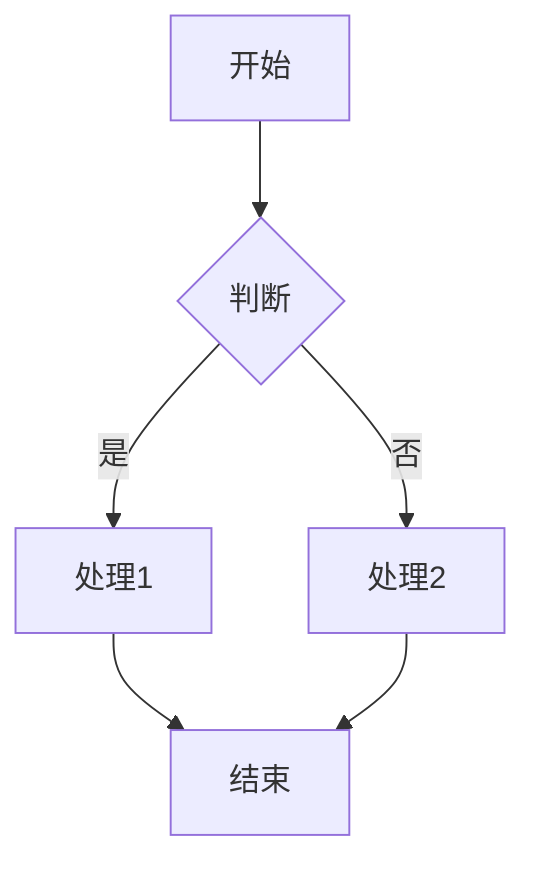
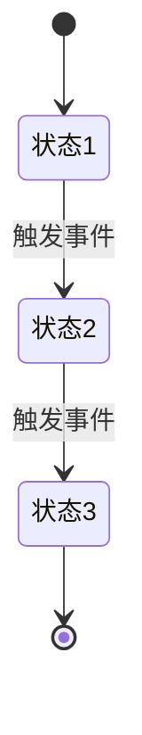
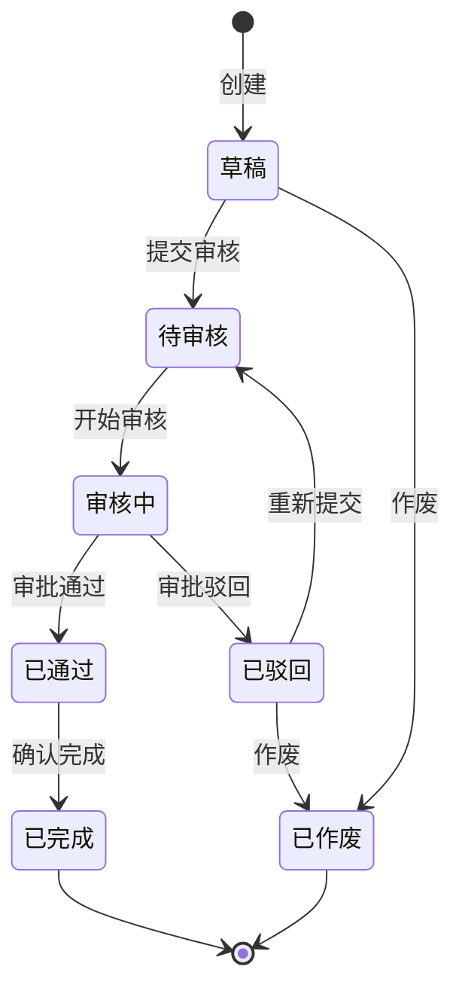

# Product Manager Skill

> 专业产品经理核心能力：需求分析、架构设计、需求文档编写、原型设计、信息架构梳理

---

## 核心原则

### 文档编写四要素

每个需求文档**必须**包含以下四个核心要素：

| 要素 | 说明 | 必填 |
|------|------|------|
| 业务目标 | 解决什么问题？成功标准是什么？ | ✅ |
| 角色权限 | 谁能做什么？权限矩阵是什么？ | ✅ |
| 状态流转 | 业务状态如何变化？触发条件是什么？ | ✅ |
| 用户处理逻辑 | 每个角色在每个状态下能做什么？ | ✅ |

---

## 能力模块

### 模块一：需求分析

#### 适用场景
- 新项目/新功能的需求调研
- 用户访谈、竞品分析
- 需求评估与优先级排序

#### 分析框架

**1. 用户分析**
```
目标用户 → 用户角色 → 用户场景 → 用户痛点 → 用户目标
```

**2. 需求拆解**
```
业务需求 → 功能需求 → 非功能需求 → 约束条件
```

**3. 优先级评估**

| 维度 | 权重 | 评估项 |
|------|------|--------|
| 业务价值 | 40% | 收入影响、效率提升、用户满意度 |
| 实现成本 | 30% | 开发工时、技术难度、依赖项 |
| 风险程度 | 20% | 技术风险、业务风险、合规风险 |
| 紧急程度 | 10% | 截止日期、依赖关系 |

**4. 业务目标定义模板**

```markdown
#### 业务目标

##### 问题描述
- **现状**：当前存在什么问题？（效率低/易出错/成本高/体验差）
- **影响范围**：影响哪些用户/部门/业务？
- **量化数据**：当前问题的量化指标是什么？（如：每月处理1000笔，错误率5%）

##### 解决方案
- **核心思路**：如何解决这个问题？
- **关键功能**：需要哪些核心功能？
- **预期效果**：上线后期望达到什么效果？

##### 成功标准
| 指标 | 当前值 | 目标值 | 衡量方式 |
|------|--------|--------|----------|
| 效率提升 | 处理时间30分钟 | 处理时间5分钟 | 系统日志 |
| 错误率降低 | 5% | 0.5% | 数据统计 |
| 用户满意度 | 60分 | 90分 | 问卷调查 |
| 成本节约 | 10万/月 | 2万/月 | 财务数据 |
```

**5. 需求规格模板**

```markdown
| 项目 | 内容 |
|------|------|
| 需求ID | FR-XXX |
| 需求名称 | |
| 优先级 | P0/P1/P2/P3 |
| 业务目标 | 解决什么问题？成功标准是什么？ |
| 需求描述 | 作为[角色]，我希望[功能]，以便[价值] |
| 目标用户 | |
| 触发条件 | |
| 输入/前置条件 | |
| 执行步骤 | 1. 2. 3. |
| 输出/后置动作 | |
| 异常处理 | |
| 验收标准 | AC1: AC2: |
```

#### 输出物
- 需求池管理文档
- 需求规格说明书（SRS）
- 需求评审检查清单

---

### 模块二：架构设计

#### 适用场景
- 系统整体架构规划
- 功能模块划分与关系梳理
- 技术选型建议

#### 设计框架

**1. 功能结构图**
```
系统
├── 模块A
│   ├── 功能A1
│   └── 功能A2
├── 模块B
│   ├── 功能B1
│   └── 功能B2
└── 模块C
```

**2. 业务流程图**


**3. 状态流转图**


**4. ER图设计**
```mermaid
erDiagram
    实体A ||--o{ 实体B : 1:N
    实体B }o--|| 实体C : N:1
```

**5. 架构分层**
```
表现层（前端/移动端）
    ↓
接入层（网关/负载均衡）
    ↓
接口层（Controller/API）
    ↓
业务层（Service/Domain）
    ↓
持久层（Repository/Mapper）
    ↓
数据层（MySQL/Redis/ES）
```

#### 输出物
- 功能结构说明书
- 业务流程图
- 状态流转图
- ER图/类图
- 技术架构图

---

### 模块三：需求文档编写

#### 适用场景
- PRD（产品需求文档）编写
- SRS（软件需求规格说明书）编写
- 功能设计文档编写

#### 文档结构模板

**PRD标准结构**
```
1. 文档信息
   - 版本记录
   - 目录

2. 业务目标 ⭐必填
   - 问题描述
   - 解决方案
   - 成功标准

3. 角色权限 ⭐必填
   - 角色定义
   - 权限矩阵
   - 数据权限

4. 产品概述
   - 产品背景
   - 产品定位
   - 目标用户
   - 核心功能

5. 功能需求
   - 功能清单
   - 功能详情（FR-xxx）
   - 状态流转 ⭐必填
   - 用户处理逻辑 ⭐必填

6. 非功能需求
   - 性能需求
   - 安全需求
   - 兼容性需求

7. 交互设计
   - 页面流程
   - 原型说明

8. 数据设计
   - 数据模型
   - 字段说明

9. 接口设计
   - API列表
   - 接口详情

10. 附录
    - 术语表
    - 参考文档
```

#### 角色权限矩阵模板

```markdown
##### 角色定义

| 角色 | 说明 | 典型用户 |
|------|------|----------|
| 系统管理员 | 系统配置、用户管理 | IT人员 |
| 运营管理员 | 日常业务操作 | 运营人员 |
| 财务人员 | 财务相关操作 | 财务人员 |
| 普通用户 | 基础功能使用 | 企业用户 |

##### 权限矩阵

| 功能 | 系统管理员 | 运营管理员 | 财务人员 | 普通用户 |
|------|:----------:|:----------:|:--------:|:--------:|
| 查看列表 | ✅ | ✅ | ✅ | ✅ |
| 新增数据 | ✅ | ✅ | ❌ | ❌ |
| 编辑数据 | ✅ | ✅ | ❌ | ❌ |
| 删除数据 | ✅ | ❌ | ❌ | ❌ |
| 审批操作 | ✅ | ❌ | ✅ | ❌ |
| 导出数据 | ✅ | ✅ | ✅ | ❌ |
| 系统配置 | ✅ | ❌ | ❌ | ❌ |

##### 数据权限

| 角色 | 数据范围 | 说明 |
|------|----------|------|
| 系统管理员 | 全部数据 | 可查看所有园区数据 |
| 运营管理员 | 本园区 | 仅查看本园区数据 |
| 财务人员 | 本园区 | 仅查看本园区财务数据 |
| 普通用户 | 本企业 | 仅查看本企业数据 |
```

#### 状态流转定义模板

```markdown
##### 状态定义

| 状态 | 编码 | 说明 | 标签颜色 |
|------|------|------|----------|
| 草稿 | DRAFT | 初始状态 | 灰色 |
| 待审核 | PENDING | 等待审核 | 橙色 |
| 审核中 | REVIEWING | 正在审核 | 蓝色 |
| 已通过 | APPROVED | 审核通过 | 绿色 |
| 已驳回 | REJECTED | 审核驳回 | 红色 |
| 已完成 | COMPLETED | 流程结束 | 绿色 |
| 已作废 | VOID | 作废状态 | 灰色 |

##### 状态流转图



##### 操作×状态矩阵

| 操作 \ 状态 | 草稿 | 待审核 | 审核中 | 已通过 | 已驳回 | 已完成 | 已作废 |
|------------|:----:|:------:|:------:|:------:|:------:|:------:|:------:|
| 编辑 | ✅ | ❌ | ❌ | ❌ | ❌ | ❌ | ❌ |
| 提交审核 | ✅ | ❌ | ❌ | ❌ | ❌ | ❌ | ❌ |
| 审核通过 | ❌ | ❌ | ✅ | ❌ | ❌ | ❌ | ❌ |
| 审核驳回 | ❌ | ❌ | ✅ | ❌ | ❌ | ❌ | ❌ |
| 确认完成 | ❌ | ❌ | ❌ | ✅ | ❌ | ❌ | ❌ |
| 重新提交 | ❌ | ❌ | ❌ | ❌ | ✅ | ❌ | ❌ |
| 作废 | ✅ | ✅ | ❌ | ❌ | ✅ | ❌ | ❌ |
| 删除 | ✅ | ❌ | ❌ | ❌ | ❌ | ❌ | ❌ |
```

#### 用户处理逻辑模板

```markdown
##### 各角色在不同状态下的处理逻辑

###### 角色1：申请人

| 状态 | 可执行操作 | 操作说明 | 前置条件 | 后置结果 |
|------|-----------|----------|----------|----------|
| 草稿 | 编辑 | 修改申请内容 | 无 | 状态不变 |
| 草稿 | 提交审核 | 提交至审核人 | 必填项完整 | 状态→待审核 |
| 草稿 | 作废 | 作废申请 | 无 | 状态→已作废 |
| 已驳回 | 重新提交 | 修改后重新提交 | 无 | 状态→待审核 |
| 已驳回 | 作废 | 作废申请 | 无 | 状态→已作废 |

###### 角色2：审核人

| 状态 | 可执行操作 | 操作说明 | 前置条件 | 后置结果 |
|------|-----------|----------|----------|----------|
| 待审核 | 开始审核 | 开始审核流程 | 无 | 状态→审核中 |
| 审核中 | 审核通过 | 审批通过 | 填写审核意见 | 状态→已通过 |
| 审核中 | 审核驳回 | 审批驳回 | 必填驳回原因 | 状态→已驳回 |

###### 角色3：确认人

| 状态 | 可执行操作 | 操作说明 | 前置条件 | 后置结果 |
|------|-----------|----------|----------|----------|
| 已通过 | 确认完成 | 确认流程完成 | 无 | 状态→已完成 |
```

#### 功能需求详情模板

```markdown
#### FR-XXX：功能名称

| 项目 | 内容 |
|------|------|
| 需求ID | FR-XXX |
| 需求名称 | |
| 优先级 | P0/P1/P2/P3 |
| 业务目标 | 解决什么问题？成功标准是什么？ |
| 需求描述 | |
| 目标用户 | |
| 触发条件 | |
| 输入/前置条件 | |
| 执行步骤 | |
| 输出/后置动作 | |
| 界面原型 | |
| 异常处理 | |
| 其他规则 | |

##### 角色权限

| 角色 | 可见性 | 可操作 | 数据范围 |
|------|--------|--------|----------|
| 角色1 | ✅ | 查看、编辑 | 全部 |
| 角色2 | ✅ | 查看 | 本部门 |
| 角色3 | ❌ | - | - |

##### 状态流转

| 状态 | 可执行操作 | 操作角色 | 触发条件 | 下一状态 |
|------|-----------|----------|----------|----------|
| 状态A | 操作1 | 角色1 | 条件1 | 状态B |
| 状态A | 操作2 | 角色2 | 条件2 | 状态C |

##### 查询条件字段说明
| 条件项 | 输入方式 | 默认值 | 规则 | 是否必填 |
|--------|----------|--------|------|----------|

##### 表单字段说明
| 字段 | 输入方式 | 默认值 | 规则 | 是否必填 |
|------|----------|--------|------|----------|

##### 数据展示字段说明
| 字段名称 | 显示格式 | 说明 |
|----------|----------|------|

##### 行操作按钮说明
| 操作 | 显示条件 | 操作角色 | 交互规则 |
|------|----------|----------|----------|
```

#### 编写规范

**1. 语言规范**
- 使用简洁明了的语言
- 避免歧义和模糊表述
- 使用主动语态
- 术语保持一致

**2. 格式规范**
- 使用表格呈现结构化信息
- 使用列表呈现枚举项
- 使用代码块呈现公式/配置
- 使用图表呈现流程/关系

**3. 完整性检查**
- [ ] 包含业务目标（问题描述+成功标准）
- [ ] 包含角色权限矩阵
- [ ] 包含状态流转定义
- [ ] 包含各角色在各状态下的处理逻辑
- [ ] 所有功能点都有对应需求ID
- [ ] 所有字段都有输入规则说明
- [ ] 所有状态都有流转规则
- [ ] 所有异常都有处理方案
- [ ] 所有接口都有参数说明

#### 输出物
- PRD产品需求文档
- SRS软件需求规格说明书
- 功能设计文档
- 接口设计文档

---

### 模块四：原型设计

#### 适用场景
- 产品原型设计
- 交互方案评审
- 开发参考依据

#### 设计框架

**1. 页面清单**
```
页面编号 | 页面名称 | 页面类型 | 所属模块
---------|----------|----------|----------
P-001    | 列表页   | 列表     | 模块A
P-002    | 详情页   | 详情     | 模块A
P-003    | 新增页   | 表单     | 模块A
```

**2. 页面注解模板**
```html
<!-- ================================================
     页面 X 注解：页面名称
     
     【业务目标】
     - 本页面解决什么问题：
     - 成功标准：
     
     【角色权限】
     - 角色1：可见✅ 可操作✅（查看、编辑）
     - 角色2：可见✅ 可操作❌（仅查看）
     - 角色3：可见❌
     
     【交互逻辑】
     - 按钮1：点击后执行XXX
     - 按钮2：点击后执行XXX
     
     【状态流转】
     - 状态A → 状态B：触发条件，操作角色
     
     【各角色处理逻辑】
     - 角色1在状态A：可执行操作1、操作2
     - 角色2在状态A：可执行操作3
     - 角色1在状态B：可执行操作4
     
     【字段规则】
     - 字段1：只读，格式XXX
     - 字段2：必填，校验XXX
     
     【条件性UI】
     - 条件1时：显示XXX
     - 条件2时：隐藏XXX
     
     【数据约束】
     - 约束1：XXX
     - 约束2：XXX
================================================ -->
```

**3. 原型元素规范**

| 元素 | 说明 | 规范 |
|------|------|------|
| 按钮 | 主按钮/次按钮/文字按钮 | 主按钮用于核心操作 |
| 表单 | 输入框/下拉/日期/单选/复选 | 必填项标红* |
| 表格 | 列表/树表/可编辑表 | 支持排序/筛选/分页 |
| 弹窗 | 确认框/抽屉/全屏 | 操作确认用弹窗 |
| 标签 | 状态标签/分类标签 | 不同状态不同颜色 |
| 提示 | 成功/警告/错误/信息 | Toast/Message/Alert |

**4. 交互规范**

| 场景 | 交互方式 |
|------|----------|
| 提交成功 | Toast提示"保存成功"，返回列表页 |
| 提交失败 | 字段下方红色提示，保留已填内容 |
| 删除操作 | 二次确认弹窗 |
| 批量操作 | 先勾选再操作，未勾选提示 |
| 加载状态 | 按钮loading，骨架屏 |
| 空状态 | 显示引导文案/插画 |

#### 输出物
- 原型文件（HTML/Axure/Figma）
- 页面注解文档
- 交互说明文档

---

### 模块五：信息架构梳理

#### 适用场景
- 系统功能模块梳理
- 需求文档的信息架构可视化
- XMind/Mermaid脑图生成
- 项目汇报、需求评审前的架构整理
- 新成员入职的系统认知培训

#### 分析步骤

**Step 1：识别系统边界**
- 系统名称
- 系统定位（服务于谁、解决什么问题）
- 核心业务流程

**Step 2：提取一级模块**
- 功能清单表格（FR-001 ~ FR-xxx）
- 目录结构
- ER图中的限界上下文
- 原型文件的页面标题

**Step 3：提取二级功能**
- 列表页（查询条件、列表字段、行操作）
- 表单页（新增/编辑字段）
- 详情页（展示区域）

**Step 4：提取三级字段**
- 查询条件字段说明表
- 表单字段说明表
- 数据展示字段说明表

**Step 5：提取业务规则**
- 状态流转图/状态定义表
- 计算公式/计费模式
- 交互规则说明
- 条件性UI说明

**Step 6：组织层级结构**
```
系统
  └── 一级模块（按业务域划分）
       └── 二级功能（按页面/操作划分）
            └── 三级区域（按页面区块划分）
                 └── 四级字段（按具体字段/规则划分）
```

#### 输出格式

**格式1：纯文本缩进（导入XMind）**
```
系统名称
	一级模块
		二级功能
			三级区域
				四级字段
```

规则：
- 每行以 `- ` 开头
- 子级用Tab缩进
- 无其他符号（#、*等）
- 每行一个节点

**格式2：Mermaid mindmap（在线渲染）**


#### 输出物
- XMind脑图文件
- Mermaid脑图文件
- 信息架构文档

---

### 模块六：文档自评审

#### 适用场景
- 文档编写完成后的自我检查
- 评审前的预审
- 文档质量把关

#### 自评审流程

```
文档编写完成 → 自评审检查 → 发现问题 → 二次修改 → 最终版本
```

#### 自评审检查清单

##### 一、业务目标检查

| 检查项 | 检查内容 | 是否通过 | 问题记录 |
|--------|----------|:--------:|----------|
| 问题描述 | 是否清晰描述当前问题？ | □ | |
| 影响范围 | 是否说明影响哪些用户/业务？ | □ | |
| 量化数据 | 是否有当前问题的量化指标？ | □ | |
| 解决方案 | 是否说明解决思路？ | □ | |
| 成功标准 | 是否有可衡量的成功指标？ | □ | |
| 目标对齐 | 成功指标是否与业务目标对齐？ | □ | |

##### 二、角色权限检查

| 检查项 | 检查内容 | 是否通过 | 问题记录 |
|--------|----------|:--------:|----------|
| 角色定义 | 是否定义所有相关角色？ | □ | |
| 权限矩阵 | 是否有完整的权限矩阵表？ | □ | |
| 数据权限 | 是否说明各角色的数据范围？ | □ | |
| 权限覆盖 | 所有功能是否都有权限控制？ | □ | |
| 权限互斥 | 是否存在权限冲突？ | □ | |

##### 三、状态流转检查

| 检查项 | 检查内容 | 是否通过 | 问题记录 |
|--------|----------|:--------:|----------|
| 状态定义 | 是否定义所有业务状态？ | □ | |
| 流转规则 | 是否有完整的状态流转图？ | □ | |
| 触发条件 | 每个流转是否有明确触发条件？ | □ | |
| 操作矩阵 | 是否有操作×状态矩阵？ | □ | |
| 终态处理 | 是否有终态定义和处理逻辑？ | □ | |
| 异常流转 | 是否考虑异常状态流转？ | □ | |

##### 四、用户处理逻辑检查

| 检查项 | 检查内容 | 是否通过 | 问题记录 |
|--------|----------|:--------:|----------|
| 角色覆盖 | 是否定义每个角色的处理逻辑？ | □ | |
| 状态覆盖 | 是否定义每个状态下的可执行操作？ | □ | |
| 前置条件 | 每个操作是否有前置条件？ | □ | |
| 后置结果 | 每个操作是否有后置结果？ | □ | |
| 边界情况 | 是否考虑边界情况？ | □ | |

##### 五、功能完整性检查

| 检查项 | 检查内容 | 是否通过 | 问题记录 |
|--------|----------|:--------:|----------|
| 需求覆盖 | 所有功能点是否有需求ID？ | □ | |
| 字段完整 | 所有字段是否有输入规则？ | □ | |
| 异常处理 | 所有异常是否有处理方案？ | □ | |
| 接口完整 | 所有接口是否有参数说明？ | □ | |
| 验收标准 | 所有需求是否有验收标准？ | □ | |

##### 六、文档质量检查

| 检查项 | 检查内容 | 是否通过 | 问题记录 |
|--------|----------|:--------:|----------|
| 语言规范 | 是否使用简洁明了的语言？ | □ | |
| 术语一致 | 术语是否全文一致？ | □ | |
| 格式规范 | 表格/列表/图表格式是否规范？ | □ | |
| 版本记录 | 是否有版本变更记录？ | □ | |
| 目录完整 | 目录是否与内容对应？ | □ | |

#### 自评审问题记录模板

```markdown
##### 自评审问题记录

| 问题编号 | 问题类型 | 问题描述 | 严重程度 | 修改方案 | 状态 |
|----------|----------|----------|----------|----------|------|
| Q-001 | 业务目标 | 缺少成功标准的量化指标 | 高 | 补充具体量化指标 | 待修改 |
| Q-002 | 角色权限 | 普通用户权限未定义 | 中 | 补充普通用户权限矩阵 | 待修改 |
| Q-003 | 状态流转 | 缺少异常状态处理 | 中 | 补充异常状态流转规则 | 待修改 |
| Q-004 | 用户逻辑 | 审核人操作说明不完整 | 中 | 补充审核人各状态处理逻辑 | 待修改 |
| Q-005 | 功能完整 | 缺少删除功能的需求说明 | 低 | 补充删除功能需求详情 | 待修改 |

**评审人**：_________
**评审日期**：_________
**评审结论**：□ 通过 □ 修改后通过 □ 不通过
```

#### 二次修改跟踪模板

```markdown
##### 二次修改记录

| 问题编号 | 原问题 | 修改内容 | 修改位置 | 修改人 | 修改日期 | 验证结果 |
|----------|--------|----------|----------|--------|----------|----------|
| Q-001 | 缺少成功标准 | 新增成功标准章节 | 第2章 | | | ✅ 已解决 |
| Q-002 | 权限未定义 | 新增权限矩阵 | 第3章 | | | ✅ 已解决 |
| Q-003 | 异常状态 | 补充状态流转图 | 第5章 | | | ✅ 已解决 |
```

#### 输出物
- 自评审检查清单
- 自评审问题记录
- 二次修改记录
- 最终文档版本

---

## 工作流程

### 完整文档编写流程

```
需求分析
    ↓
业务目标定义（解决什么问题？成功标准？）
    ↓
角色权限定义（谁能做什么？）
    ↓
状态流转定义（业务状态如何变化？）
    ↓
用户处理逻辑（每个角色在每个状态下能做什么？）
    ↓
功能需求编写
    ↓
原型设计
    ↓
文档自评审
    ↓
二次修改
    ↓
最终版本
```

### 需求分析阶段
```
用户调研 → 需求收集 → 需求分析 → 需求评审 → 需求排期
```

### 设计阶段
```
架构设计 → 功能拆解 → 原型设计 → 交互评审 → 设计定稿
```

### 文档阶段
```
PRD编写 → 自评审 → 二次修改 → 需求评审 → 文档定稿
```

### 开发支持阶段
```
需求答疑 → 设计走查 → 验收测试 → 上线跟踪
```

## 常用工具

| 工具类型 | 推荐工具 | 用途 |
|----------|----------|------|
| 原型设计 | Axure/Figma/墨刀 | 页面原型 |
| 思维导图 | XMind/ProcessOn | 信息架构 |
| 流程图 | draw.io/ProcessOn | 业务流程 |
| 文档协作 | 飞书/语雀/Notion | 需求文档 |
| 项目管理 | Jira/禅道/飞书 | 需求管理 |

## 注意事项

1. **业务目标**：每个需求必须有明确的业务目标和可衡量的成功标准
2. **角色权限**：必须定义完整的角色权限矩阵，覆盖所有功能和数据
3. **状态流转**：涉及多环节的业务必须定义完整的状态流转规则
4. **用户逻辑**：必须定义每个角色在每个状态下的具体处理逻辑
5. **自评审**：文档编写完成后必须进行自评审，发现问题后二次修改
6. **需求一致性**：避免需求之间的矛盾和冲突
7. **需求可测试性**：每个需求都有明确的验收标准
8. **需求可追溯性**：需求ID贯穿设计、开发、测试全流程
9. **文档版本管理**：每次修改记录版本号和变更内容
