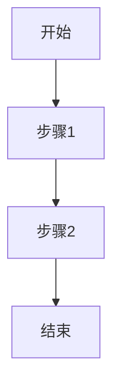
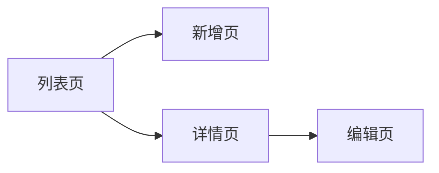

# 产品需求文档（PRD）模板

> 适用于产品需求文档编写

---

━━━━━━━━━━━━━━━━━━━━━━━━━━━━━━━━━━
文档编号：PRD-[项目代号]-001
版本：V1.0
状态：草稿 / 评审中 / 基线 / 废止
创建日期：YYYY-MM-DD
最后更新：YYYY-MM-DD
作者：__
审批人：__
━━━━━━━━━━━━━━━━━━━━━━━━━━━━━━━━━━


修订记录

| 版本 | 日期 | 修订内容 | 修订人 | 审批人 |
| ---- | ---- | -------- | ------ | ------ |
| V1.0 | | 初始创建 | | |


---

## 1. 文档信息

### 1.1 文档目的
*说明本文档的目的和预期读者*

### 1.2 目标读者
| 读者角色 | 阅读目的 |
|----------|----------|
| 产品经理 | 理解需求全貌，指导产品设计 |
| 开发工程师 | 理解功能细节，指导技术实现 |
| 测试工程师 | 编写测试用例，验收功能 |
| 项目经理 | 评估工作量，制定计划 |

### 1.3 术语定义
| 术语/缩写 | 定义 |
|-----------|------|
| | |

### 1.4 参考文档
| 文档名称 | 版本 | 来源 |
|----------|------|------|
| | | |

---

## 2. 业务目标 ⭐必填

### 2.1 问题描述
- **现状**：当前存在什么问题？（效率低/易出错/成本高/体验差）
- **影响范围**：影响哪些用户/部门/业务？
- **量化数据**：当前问题的量化指标（如：每月处理1000笔，错误率5%）

### 2.2 解决方案
- **核心思路**：如何解决这个问题？
- **关键功能**：需要哪些核心功能？
- **预期效果**：上线后期望达到什么效果？

### 2.3 成功标准
| 指标 | 当前值 | 目标值 | 衡量方式 |
|------|--------|--------|----------|
| 效率提升 | | | 系统日志 |
| 错误率降低 | | | 数据统计 |
| 用户满意度 | | | 问卷调查 |
| 成本节约 | | | 财务数据 |

---

## 3. 角色权限 ⭐必填

### 3.1 角色定义
| 角色 | 说明 | 典型用户 |
|------|------|----------|
| 系统管理员 | 系统配置、用户管理 | IT人员 |
| 运营管理员 | 日常业务操作 | 运营人员 |
| 财务人员 | 财务相关操作 | 财务人员 |
| 普通用户 | 基础功能使用 | 企业用户 |

### 3.2 权限矩阵
| 功能 | 系统管理员 | 运营管理员 | 财务人员 | 普通用户 |
|------|:----------:|:----------:|:--------:|:--------:|
| 查看列表 | ✅ | ✅ | ✅ | ✅ |
| 新增数据 | ✅ | ✅ | ❌ | ❌ |
| 编辑数据 | ✅ | ✅ | ❌ | ❌ |
| 删除数据 | ✅ | ❌ | ❌ | ❌ |
| 审批操作 | ✅ | ❌ | ✅ | ❌ |
| 导出数据 | ✅ | ✅ | ✅ | ❌ |
| 系统配置 | ✅ | ❌ | ❌ | ❌ |

### 3.3 数据权限
| 角色 | 数据范围 | 说明 |
|------|----------|------|
| 系统管理员 | 全部数据 | 可查看所有园区数据 |
| 运营管理员 | 本园区 | 仅查看本园区数据 |
| 财务人员 | 本园区 | 仅查看本园区财务数据 |
| 普通用户 | 本企业 | 仅查看本企业数据 |

---

## 4. 产品概述

### 4.1 产品背景
*描述产品/功能的背景信息*

### 4.2 产品定位
*说明产品在整体系统中的定位*

### 4.3 目标用户
| 用户类型 | 特征描述 | 主要使用场景 |
|----------|----------|------------|
| | | |

### 4.4 核心功能清单
+ 功能1：简要说明
+ 功能2：简要说明
+ 功能3：简要说明

### 4.5 业务流程图


---

## 5. 功能需求

### 5.1 需求概览

| 需求ID | 需求名称 | 优先级 | 来源 | 状态 |
|--------|----------|--------|------|------|
| FR-001 | | P0/P1/P2 | | 待开发 |

> 优先级：P0=必须实现，P1=重要，P2=一般

### 5.2 功能需求详情

#### FR-001：[需求名称]

| 项目 | 内容 |
|------|------|
| 需求ID | FR-001 |
| 需求名称 | |
| 优先级 | P0（必须实现）/P1（重要）/P2（一般） |
| 业务目标 | 解决什么问题？成功标准是什么？ |
| 需求描述 | 作为[角色]，我希望[功能]，以便[价值] |
| 目标用户 | |
| 触发条件 | 用户操作（如点击菜单/按钮）或系统自动触发 |
| 输入/前置条件 | 数据存在、权限满足、状态符合等 |
| 执行步骤 | 1. 2. 3. |
| 输出/后置动作 | 数据变更/页面跳转/状态更新/通知发送等 |
| 界面原型 | |
| 异常处理 | 1. [异常场景]：[现象]，处理：[系统响应] |
| 其他规则 | 1. 2. |
| 验收标准（AC） | [ ] AC1： [ ] AC2： |
| 依赖需求 | 依赖哪些FR |
| 备注 | |

##### 角色权限 ⭐必填

| 角色 | 可见性 | 可操作 | 数据范围 |
|------|--------|--------|----------|
| 角色1 | ✅ | 查看、编辑 | 全部 |
| 角色2 | ✅ | 查看 | 本部门 |
| 角色3 | ❌ | - | - |

##### 状态流转 ⭐必填

| 状态 | 可执行操作 | 操作角色 | 触发条件 | 下一状态 |
|------|-----------|----------|----------|----------|
| 状态A | 操作1 | 角色1 | 条件1 | 状态B |
| 状态A | 操作2 | 角色2 | 条件2 | 状态C |

##### 各角色在不同状态下的处理逻辑 ⭐必填

###### 角色1：申请人

| 状态 | 可执行操作 | 操作说明 | 前置条件 | 后置结果 |
|------|-----------|----------|----------|----------|
| 状态A | 操作1 | 说明 | 条件 | 结果 |
| 状态B | 操作2 | 说明 | 条件 | 结果 |

###### 角色2：审核人

| 状态 | 可执行操作 | 操作说明 | 前置条件 | 后置结果 |
|------|-----------|----------|----------|----------|
| 状态A | 操作3 | 说明 | 条件 | 结果 |

##### 查询条件字段说明
> 当需求涉及列表页查询/筛选功能时填写

| 条件项 | 输入方式 | 默认值 | 规则 | 是否必填 |
|--------|----------|--------|------|----------|
| 条件名称 | 文本输入框/下拉选择框/日期选择框 | 默认值 | 校验规则、联动逻辑 | 是/否 |

##### 操作按钮说明
> 当列表页顶部的工具栏/操作区有按钮时填写

| 按钮 | 位置 | 样式 | 交互规则 |
|------|------|------|----------|
| 按钮名称 | 工具栏左侧/右侧 | 主按钮/默认按钮/危险按钮 | 点击后的行为 |

##### 行操作按钮说明
> 当列表中每行数据有操作按钮时填写

| 操作 | 显示条件 | 交互规则 |
|------|----------|----------|
| 查看 | 所有状态 | 点击跳转到详情页 |
| 编辑 | 仅草稿状态 | 点击跳转到编辑页 |
| 删除 | 仅草稿状态 | 点击弹出确认对话框 |

##### 数据展示字段说明
> 当需求涉及列表/表格数据展示时填写

| 字段名称 | 显示格式 | 说明 |
|----------|----------|------|
| 字段名 | 左对齐/右对齐 格式约束 | 特殊说明 |

##### 表单字段说明
> 当需求涉及表单输入/编辑时填写

| 字段 | 输入方式 | 默认值 | 规则 | 是否必填 |
|------|----------|--------|------|----------|
| 字段名 | 单行文本输入框/下拉选择框/数字输入框 | 默认值 | 校验规则 | 是/否 |

##### 底部操作按钮
> 当表单页面底部有保存/取消等操作按钮时填写

| 按钮 | 样式 | 交互规则 |
|------|------|----------|
| 保存 | 主按钮 | 提交前校验所有必填项 |
| 取消 | 默认按钮 | 点击弹出确认提示 |

##### 详情页区域说明
> 当需求涉及详情/查看页面时填写

| 区域 | 展示内容 | 说明 |
|------|----------|------|
| 区域名称 | 包含的字段列表 | 数据来源、只读条件 |

##### 状态流转定义
> 当需求涉及业务状态流转时填写

| 状态 | 定义 | 可操作 | 下一状态 |
|------|------|--------|----------|
| 状态A | 状态含义 | 允许的操作列表 | 可到达的下一状态 |

##### 交互规则
> 当需求涉及多条件/多场景下的不同行为时填写

| 场景 | 规则 |
|------|------|
| 正常操作 | 描述 |
| 边界情况 | 描述 |
| 异常情况 | 描述 |

##### 约束规则
> 当需求有数据一致性/业务约束/校验规则时填写

| 规则 | 说明 |
|------|------|
| 规则名称 | 规则详细描述 |

---

## 6. 非功能需求

### 6.1 性能需求
| 指标 | 要求 | 测试场景 |
|------|------|----------|
| 页面响应时间 | P99 < 2秒 | 正常负载下 |
| 并发用户数 | 支持1000并发 | 峰值压力测试 |
| 数据库查询响应 | < 500ms | 单次查询 |

### 6.2 安全需求
- 认证方式：JWT/OAuth2
- 授权模型：RBAC
- 数据加密：传输层TLS 1.2+；敏感字段AES-256
- 安全日志：操作审计日志保留180天

### 6.3 可靠性需求
- 系统可用性：≥ 99.9%（SLA）
- RTO（恢复时间目标）：≤ 4小时
- RPO（恢复点目标）：≤ 1小时
- 数据备份：每日全量 + 实时增量

### 6.4 可维护性
- 代码覆盖率：≥ 80%
- 文档完整性：接口文档覆盖率100%

### 6.5 兼容性
- 浏览器：Chrome 90+, Firefox 90+, Safari 14+, Edge 90+
- 移动端：iOS 13+, Android 9+

---

## 7. 交互设计

### 7.1 页面流程


### 7.2 原型说明
*附原型文件链接或截图*

### 7.3 交互规范
| 场景 | 交互方式 |
|------|----------|
| 提交成功 | Toast提示"保存成功"，返回列表页 |
| 提交失败 | 字段下方红色提示，保留已填内容 |
| 删除操作 | 二次确认弹窗 |
| 批量操作 | 先勾选再操作，未勾选提示 |

---

## 8. 数据设计

### 8.1 数据模型
```mermaid
erDiagram
    实体A ||--o{ 实体B : 1:N
    实体B }o--|| 实体C : N:1
```

### 8.2 核心数据实体
| 实体 | 关键字段 | 说明 |
|------|----------|------|
| | | |

### 8.3 数据保留策略
| 数据类型 | 保留期限 | 处理方式 |
|----------|----------|----------|
| 操作日志 | 180天 | 到期自动归档 |
| 业务数据 | 永久 | 归档保留 |

---

## 9. 接口设计

### 9.1 外部接口
| 接口名称 | 对接方 | 接口类型 | 优先级 | 备注 |
|----------|--------|----------|--------|------|
| | | REST/gRPC | | |

### 9.2 内部接口
| 接口名称 | 调用方式 | 说明 |
|----------|----------|------|
| | 同步/异步 | |

### 9.3 接口详情
- **接口名**：
- **地址**：
- **调用方式**：GET/POST/PUT/DELETE
- **请求参数**：
- **响应格式**：
- **错误码**：

---

## 10. 附录

### 10.1 术语表
| 术语 | 定义 |
|------|------|
| | |

### 10.2 参考文档
| 文档名称 | 版本 | 来源 |
|----------|------|------|
| | | |

### 10.3 待确认问题
| 问题ID | 问题描述 | 提问人 | 提问日期 | 待确认方 | 状态 |
|--------|----------|--------|----------|----------|------|
| Q-001 | | | | | 待确认 |

---

*本文档模板参考 CMMI V3.0 标准编制*
